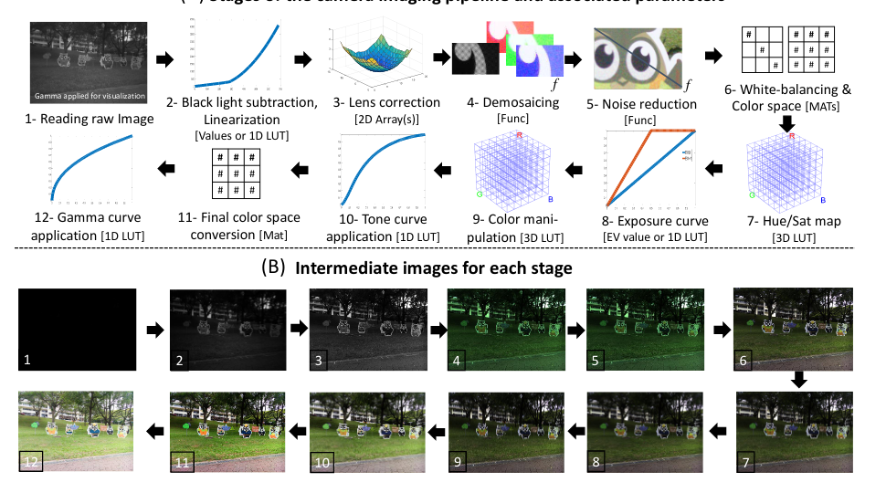
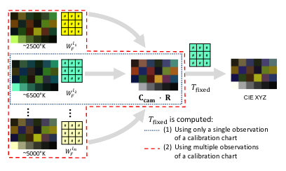
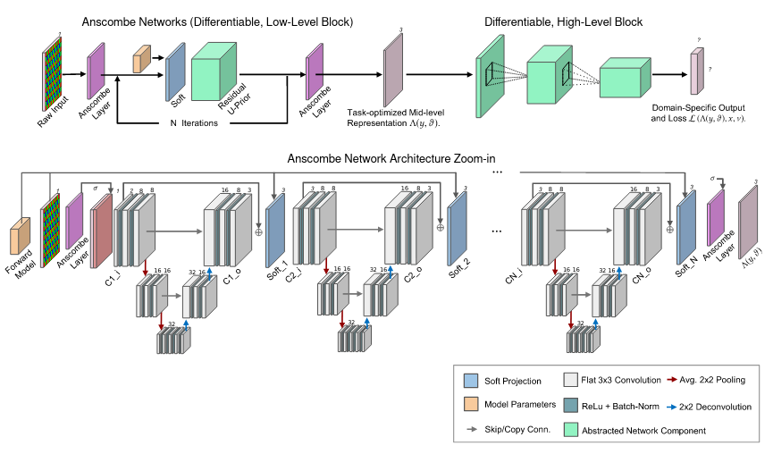
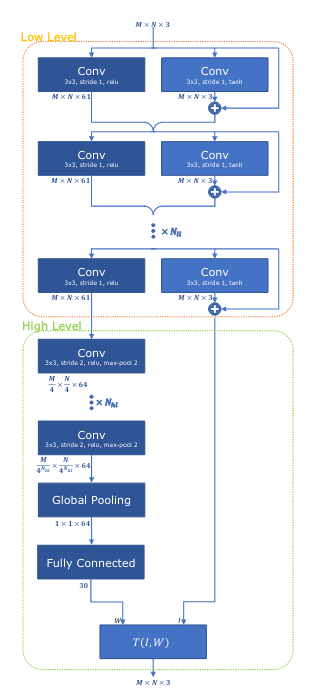
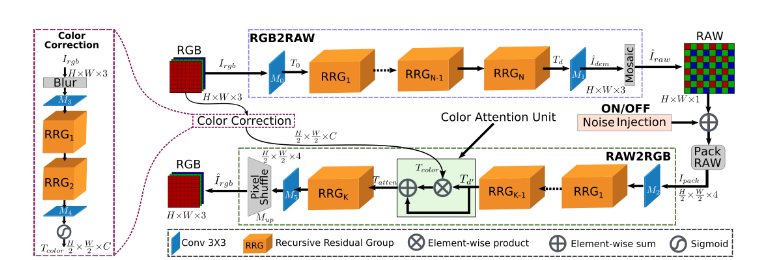
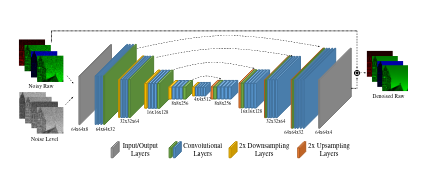
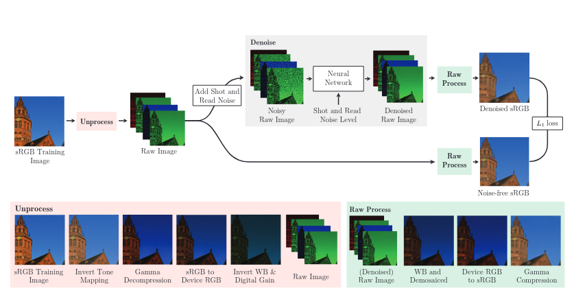

# Литературный Обзор

## Общие положения

В современных фотокамерах процесс получения изображения (ISP - image signal processing) состоит из множества шагов таких как например демозаика, преобразование цветовых пространств, определение баланса белого и т.д. Многие из этих алгоритмов не имеют точного решения и зависят от множества свободных переменных. В добавок следует отметить, что производители многих камер скрывают исходный код этих алгоритмов и зачастую встраивают его в камеры. С другой стороны технологии компьютерного зрения и алгоритмы машинного обучения в последнее время показывают впечатляющее результаты в различных задачах. Это дает основания поставить вопрос насколько глубокие нейронные сети способны аппроксимировать классические алгоритмы ISP и возможно ли заменить весь процесс реконструкции изображения одним нейросетевым алгоритмом. 

В случае успеха исследования можно будет добиться следующих аспектов:

- Аппроксимация ISP различных камер позволит унифицировать этот алгоритм для различных устройств;
- Замена множества алгоритмов одним позволит ускорить процесс реконструкции изображений;
- Возможно построение различных вариантов ISP (например конвейер нацеленный на улучшение человеческого восприятия изображения и конвейер нацеленный на улучшение восприятие изображений другими алгоритмами машинного зрения);
- Возможна настройка такого алгоритма для решения других оптимизационных задач связанных с обработкой изображений.

## Список литературы

Следующий список статей подобран таким образом, чтобы ответить на следующие вопросы:

- Актуальность существующей проблемы [2] [3] [8];
- Описание существующих алгоритмических решений используемых в камерах [2] [3] [4] [5] [8];
- Описание попыток создания нейросетевых end2end конвейеров [6] [7] [9] [10];
- Описание обучающей выборки и сопутствующего к ней ПО [1] [2].

#### Основные статьи

- [1. The Cube++ Illumination Estimation Dataset](https://ieeexplore.ieee.org/document/9296220)
  
  - *О чем статья?*
    Вычислительное постоянство цвета имеет важную задачу уменьшения влияния освещения сцены на цвета объектов. Такая задача является частью конвейеров обработки изображений большинства цифровых камер (ISP piepline). Одной из важных частей вычислительного постоянства цвета является оценка освещенности (illumination estimation). Когда предлагается метод оценки освещенности, его точность обычно сообщается путем измерения значений показателей ошибок, полученных на изображениях общедоступных наборов данных. Однако, что многие из таких наборов данных имеют такие проблемы, как малое кол-во изображений, низкое качество изображения, отсутствие разнообразия сцен, отсутствие отслеживания версий, нарушение различных допущений, нарушение правил GDPR, отсутствие дополнительной информации о процедуре съемки и т.д. В рассматриваемой статье предлагается новый набор данных для оценки освещенности, который призван облегчить многие из упомянутых проблем. Он состоит из 4890 изображений с известными цветами освещенности (illumination colors), а также с дополнительными данными, которые могут в дальнейшем сделать процесс обучения более точным. В датасете используется мишень для коллибровки (SpyderCube) и для каждого изображения имеется две записи освещенности, охватывающие разные направления. Благодаря этому, набор данных может использоваться для обучения и тестирования методов, которые выполняют оценку с одним или двумя источниками света. Это делает его превосходящим многие аналогичные существующие наборы данных.
  
  - *Ключевые моменты*
    Дается общее описание задачи и вводится понятие цвета наблюдаемого источника света
    
    $$
    \mathbf {e} = \begin{pmatrix} e_{R} \\ e_{G} \\ e_{B}\end{pmatrix} = \int _\omega I(\lambda )\mathbf {\boldsymbol {\rho }}(\lambda )d\lambda

    $$
    
    где r+g+b = 1
    Далее даются ссылки на алгоритмические и нейросетевые подходы метода оценки освещенности.
    Затем говориться о том что в мире существует довольно мало открытых наборов данных для решения этой задачи и выводится ряд требований характерезующий качество таких наборов данных. Затем делается утверждение о том что рассматриваемый в статье набор данных Cube++ соответствует требованиям высококачественного набора данных. Далее в статье приводятся подтверждение выдвинутого тезиса и сравнение Cube++ с другими существующими наборами данных.
  
  - *Выводы*
    Данный набор данных может быть очень полезен для предполагаемого исследования так как, во-первых, содержит большое число изображений и высокую степень их разнообразия. Во вторых имеет применимый к решаемой задаче формат данных (RAW+JPEG). Наконец данный набор данных является открытым что повысит воспроизводимость предполагаемых опытов и экспериментов.

- [2. A Software Platform for Manipulating the
  Camera Imaging Pipeline](https://karaimer.github.io/camera-pipeline/paper/Karaimer_Brown_ECCV16.pdf)
  
  - *О чем статья?*
    На борту цифровой камеры применяется ряд этапов обработки, которые в совокупности составляют конвейер обработки изображений (ISP piepline). К сожалению, конвейер обработки изображений обычно встроен в аппаратное обеспечение камеры и имеет закрытый код, что затрудняет работу исследователей, работающих над отдельными его компонентами. Это не только затрудняет исследования, но и делает оценку влияния изменения отдельного компонента конвейера на конечный результат камеры сложной или невозможной. В данной статье представлена программная платформа, которая позволяет получить легкий доступ к каждому этапу конвейера обработки изображений с камеры. Платформа позволяет изменять параметры отдельных компонентов, а также получать доступ к промежуточным изображениям. Помимо этого статья дает детальное описание самого конвейера обработки изображений, и является базисом для понимания этой темы.
  
  - *Ключевые моменты*
    В статье говорится о том что процесс обработки изображения состоит из ряда шагов:
    
    Как говорилось, в статье обозревается открытый разработанный конвейер позволяющий работать с различными шагами ISP и имеющий мощьный API. 
    
    - На вход принимается RAW DNG картинка (можно пользоваться Adobe DNG conversion software tool для перевода RAW в этот формат)
    - Вычитание черного и линеаризация. Изображение линеаризуется таким образом, что его значения варьируются в [0-1].
    - Коррекция линзы / плоского поля. Компенсация искажений объектива и неравномерноого светового падения. 
    - Демозаика. Преобразование 1 канального изображения в RGB, путем интерполяции отсутствующих значения в шаблоне Байера.
    - Шумоподавление. 
    - Баланс белого и преобразование цветового пространства. Преобразование цветового пространства между RGB и стандартным ц.п. (например, ProPhoto RGB)
    - Hue / Sat. Эта дополнительная процедура предназначеная для преобразования цветового пространства, чтобы обеспечить нелинейное преобразование, которое необходимо включить для улучшения цветопередачи.
    - Компенсация экспозиции. Цифровая регулировка экспозиции т.е. управления настройками выдержки, диафрагмы и т д.
    - Манипуляции с цветом. Камеры часто применяют свои собственная пост обработки цвета (режим горы, партрет и т д.)
    - Преобразование кривой тона.
    - Окончательное преобразование цветового пространства (RGB -> sRGB).
    - Гамма коррекция.  
  
  - *Выводы*
    
    - Данная статья несет 2 ключевые точки:
      1. Дает понимание различных шагов конвейера обработки изображений и их описание.
      2. Предоставляет мощьный API который может быть полезен с практической точки зрения для генерации различных наборов данных из Cube++ и нейросетевой аппроксимации различных шагов ISP.

- [3. Color Image Processing Pipeline](https://www2.cs.sfu.ca/~mark/ftp/SignalProcessing05/Color_image_processing_pipeline05.pdf)
  
  - *О чем статья?*
    В этой статье представлен обзор конвейера обработки изображений, сначала с точки зрения обработки сигналов, а затем с точки зрения реализации, с учетом связанных с этим компромиссов.
  - *Выводы*
    Данная статья во многом дополняет предыдущую статью и дает некоторое теоретическое описание различных шагов ISP. С практической точки зрения она важна как некоторая база знаний, позволяющая понять физические и математические аспекты различных преобразований.

- [4. Learning the image processing pipeline](https://arxiv.org/pdf/1605.09336.pdf)
  
  - *Выводы*
    Еще одна статья описывающая процесс ISP с применением классических алгоритмов которую можно использовать как базу знаний.

- [5. Improving Color Reproduction Accuracy on Cameras](https://openaccess.thecvf.com/content_cvpr_2018/papers/Karaimer_Improving_Color_Reproduction_CVPR_2018_paper.pdf)
  
  - *О чем статья?*
    Одной из ключевых операций, выполняемых с цифровой камерой, является сопоставление цветового пространства, специфичного для датчика, со стандартным цветовым пространством восприятия. Эта процедура включает в себя применение коррекции баланса белого с последующим преобразованием цветового пространства. Текущий подход к этому колориметрическому отображению основан на интерполяции предварительно откалиброванных преобразований цветового пространства, вычисленных для двух фиксированных освещений (т.e. двух настроек баланса белого). Изображения, снятые при различном освещении, имеют меньшую точность цветопередачи из-за использования этого процесса интерполяции. В этой статье обсуждаются ограничения текущего подхода к колориметрическому отображению и предлагаем два метода, которые способны повысить точность цветопередачи. Здесь оценивают подход на семи различных камерах и показываем улучшения до 30% (зеркальные камеры) и 59% (камеры мобильных телефонов) с точки зрения ошибки.
  - *Ключевые моменты*
    Статья рассматривает один из шагов ISP. Сначала дается описание существующих подходов:
    - Описывается цель такого преобразования, Формат представления данных, Математические преобразования
    - Затем описывается подход Расширенной интерполяция - включение дополнительной калибровачной подсистемы в процесс интерполяции.
    - Использование полного цветового баланса.
      
  - *Выводы*
    Данная статья описывает пожалуй один из самых важных шагов в конвейере ISP. Она может быть очень полезна при построении нейросетевого конвейера ISP в который можно заложить принципы и эверистики описанные в данной статье, чтобы повысить качество ISP.

- [6. Dirty Pixels: Towards End-to-End Image Processing and Perception](https://arxiv.org/pdf/1701.06487.pdf)
  
  - *О чем статья?*
    Системы визуализации реального мира получают измерения, которые ухудшаются из-за шума, оптических аберраций и других недостатков, которые усложняют обработку изображений для человеческого просмотра и задач восприятия более высокого уровня. Обычные камеры решают эту проблему, отделяя изображение от обработки задач высокого уровня. Таким образом, обычная визуализация включает обработку необработанных измерений датчиков в последовательном цикле этапов, таких как демозаикинг, шумоподавление, удаление размытия, отображение тона и сжатие. Этот конвейер оптимизирован для получения визуально приятного изображения. С другой стороны, обработка высокого уровня включает в себя такие этапы, как извлечение объектов, классификация, отслеживание и объединение. Хотя этот изолированный подход к проектированию позволяет эффективно работать, он также влияет на отдельные показатели. Например, современные алгоритмы шумоподавления разработаны с использованием качества восприятия изображения, но не с учетом специфичных для предметной области задач, таких как обнаружение объектов. В статье предлагается end2end настраиваемая архитектура, которая совместно выполняет ISP. Архитектура не требует каких-либо промежуточных функций потерь, основанных на качестве воспринимаемого изображения, и использует конвейеры обработки, выходы которых отличаются от выходов существующих, оптимизированных для качества восприятия, сохраняя мелкие детали за счет увеличения шума и артефактов. На полученных и смоделированных данных мы демонстрируем, что end2end ISP модель существенно улучшает восприятие при слабом освещении и в других сложных условиях, что крайне важно для реальных приложений, таких как робототехника и наблюдение.
  - *Ключевые моменты*
    - Существующие ISP ориентированы на человеческое восприятие изображения. Однако в них теряется большая часть информации которая была бы полезна для обработки алгиритмами компьютерного зрения.
    - Если обучаь нейронные сети на RAW изображениях то можно добиться лучшего качества распознавания.
    - В статье предлагается совместить нейросетевой ISP и классификацию и утверждается что такой подход позволяет повысить качество последней (особенно при слабом освещении). Архитектура получила название Anscombe
    - Модель оптимизации обеспечивает обобщение для всех модификаций камер. Здесь реконструкция изображения вводится как задача оптимизации:
      
    - Архитектура предствавляет из себя набор U-Net ов с conv 3*3, ReLU и avg pool.
    - Далее сравниваются показания классификаторов со стандартным ISP и предлагаемым в статье.
    - Затем говорится что подобная архитектура способна обобщать ISP ориентированный на восприятие человеком. Сравнение происходит по PSNR и SSIM. 
  - *Выводы*
    Данная статья являтеся основным конкурентом в предполагаемых исследованиях и по этому очень важна. Имеющася у нее открытая имплементация позволяет воспроизвезти полученные результаты и разобрать исследование на составные части.

- [7. DeepISP: Towards Learning an End-to-End Image Processing Pipeline](https://arxiv.org/pdf/1801.06724.pdf)
  
  - *O чем статья?*
    Мы представляем Deep ISP, полную сквозную глубокую нейронную модель конвейера обработки сигналов изображения с камеры (ISP). Наша модель изучает отображение по необработанному мозаичному изображению с низкой освещенностью к окончательному визуально привлекательному изображению и включает в себя низкоуровневые задачи, такие как демонстрация и шумоподавление, а также задачи более высокого уровня, такие как коррекция цвета и настройка изображения. Обучение и оценка конвейера проводились на специальном наборе данных, содержащем пары изображений с низкой освещенностью и хорошим освещением, снятых камерой смартфона Samsung S7 как в формате raw, так и в обработанном формате JPEG. Предлагаемое решение обеспечивает самые современные результаты в объективной оценке PSNR по подзадаче совместного шумоподавления и демонстрации. Для полного сквозного конвейера он обеспечивает лучшее качество изображения по сравнению с конвейером производителя, как при субъективной оценке человеком, так и при оценке глубокой моделью, обученной для оценки качества изображения
  - *Ключевые моменты*
    - Это еще один нейросетевой end2end ISP, вышедший ранее.
    - Архитектура состоит из 2 частей. 1я часть извлекает низкоуровневые фичи и ивечает за демозаикинг\первичную обработку изображения. Вторая часть выполняет преобразование цветовых пространств\гамма коррекцию. 
      
    - В качестве Loss функции для 1го уровня иполлтзуется L2+PSNR. Далее для всего ISP используется L1+MS-SSIM.
    - В качестве метрик используется MOS и PSNR
  - *Выводы*
    Данная статья является еще одним конкурентом нашего предполагаемого исследования и по этому также важна. Однако малый датасет на котором были получены результаты и закрытая имплементация затрудняет воспроизводимость полученных результатов.

#### Вспомогательные статьи

- [8. Reconfiguring the Imaging Pipeline for Computer Vision](https://arxiv.org/pdf/1705.04352.pdf)
  
  - *О чем статья:*
    В статье обозреваются проблемы классических ISP и говорится о том что с использованием нейросетевых ISP есть возможность повысить качество работы алгоритмов CV и улучшить работу существующих ISP в сложных условиях.
  - *Выводы*
    Данная статья полезна для обоснования актуальности исследования.

- [9. CycleISP: Real Image Restoration via Improved Data Synthesis](https://arxiv.org/pdf/2003.07761.pdf)
  
  - *О чем статья*
    Проблема заключается в том, что сбор реального набора данных является громоздкой процедурой. Следовательно, алгоритмы шумоподавления изображения в основном разрабатываются и оцениваются на синтетических данных, которые обычно генерируются с помощью предположение об аддитивном белом гауссовском шуме (AWGN). CNN достигают впечатляющих результатов на этих синтетические наборах данных но не работают на реальных данных. Это происходит потому, что AWGN не подходит для моделирования реального шума камеры, который является сигнально зависимым и сильно зависит от ISP. В этой статье мы представляем структуру, которая моделирует ISP в прямом и обратном направлениях. Это позволяет создавать любое количество пар реалистичных изображений для шумоподавления как в пространствах RAW, так и в sRGB. На этих парах была обучена новая сеть шумоподавления изображений на реалистичных синтетических данных. Кроме того, мы демонстрируем, что архитектура не ограничивается шумоподавлением изображения и может решать другие задачи например согласование цветов.
  - *Ключевые моенты*
    - Предлагается архитектура моделирующая ISP в прямом и обратном направлениях
      
    - Затем с помощью нее генерятся пары изображений для обучения модели шумоподавления.
    - Сеть RGB2RAW оптимизируется с помощью линейной и логарифмической L1
    - RAW2RGB оптимизируется с помощью линейной L1
    - RAW2RGB использует специальный Color attention unit.
  - *Выводы*
    Данная статья может быть очень полезна для проектирования RAW2RGB конвейера и ее наработки можно использовать. Открытая имплементация способствует воспроизводимости результата. 

- [10. Unprocessing Images for Learned Raw Denoising](https://arxiv.org/pdf/1811.11127.pdf)
  
  - *О чем статья*
    В статье приводится архитектура нейросетевого шумоподавления и применением RAW изображений. По сути это ISP ориентированный на шумоподавление.
  - *Ключевые моенты*
    - Используется U-Net образная архитектура
      
      
    - Даются описание процессов и этапов ISP
  - *Выводы*
    Подобно придедущей статье данная работа может быть полезна и с небольшими изменениями использована как каркас для End2End ISP.

## Выводы

Существующие статьи не только показывают нерешенность и актуальность данной проблемы, но дают некоторые подсказки к поиску возможных путей решения вышеописанной задачи. Во-первых, в статьях есть описания данных на которых можно ставить эксперименты [2]. Во-вторых, есть писание ПО, воспроизводящее различные шаги ISP что позволит разбть задачу на составные части и аппроксимировать каждый этап реконструкции отдельно, а затем объединить полученные результаты. В-третьих, наличие у основных конкурентов открытых реализаций их подходов позволит с легкостью сравнить полученое в результате экспериментов решения с существующими аналогами.

Исходя из вышесказанного можно предложить следующую стратегию исследования

1. На существующем открытом наборе [1] данных воспроизвезти эксперименты конкуретнов [6] [7].
2. С помощью существующего открытого ПО [2] разделить процесс на составные части и аппроксимировать каждую из них нейросетевыми моделями.
3. Соединить полученные модели и измерить результаты
4. Обучить одну модель без промежуточных шагов и сравнить результаты.